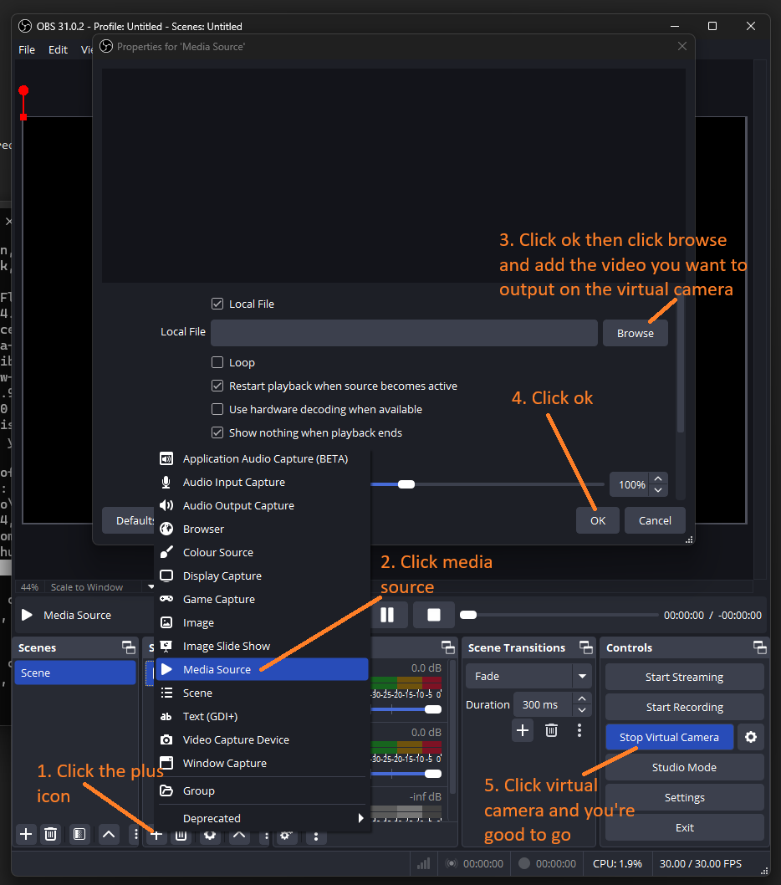

# Welcome to VirtualLifeguard!

## VirtualLifeguard  is an open source open water drowing detection application.

### To use VirtualLifeguard please follow the following instructions
Please note that this application has been designed for windows and the following commands are intended to be run using
PowerShell. The application might also run on Linux and MacOS but this has not been tested.
The version of Python this application was tested on was 3.12, in addition to Python you will also need pip to install
the application. you either need to have a camera installed in your machine or use a virtual camera. If you want to use
a virtual camera I would suggest using OBS. There are also some example videos which can be used to show the application
would work in a real life scenario.

1. Clone the repository using: `git clone https://github.com/petrocb/virtualLifeguard.git`
2. Once inside the repository create a venv using: `python -m venv ./venv`
3. Once a venv has been created please activate it using: `./venv/Scripts/Activate.ps1`
4. Now you have a clean venv you can install the application. Just run: `pip install -r requirements.txt`. This might take some time
5. The final version of the project is located in `finalVersion` to run this version please enter the command: `python .\finalVersion\main.py`
6. Feel free to try the other versions of the application.

The next set of instructions will show you how to use OBS to take advantage of the example videos
1. install OBS from: `https://obsproject.com/`
2. The example vidoes are located in the `exampleVideos` folder. You can use these videos to test the application.
3. Once you have OBS installed follow the instructions below:
